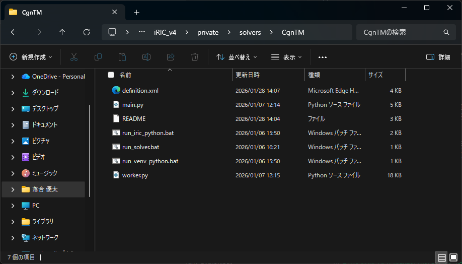
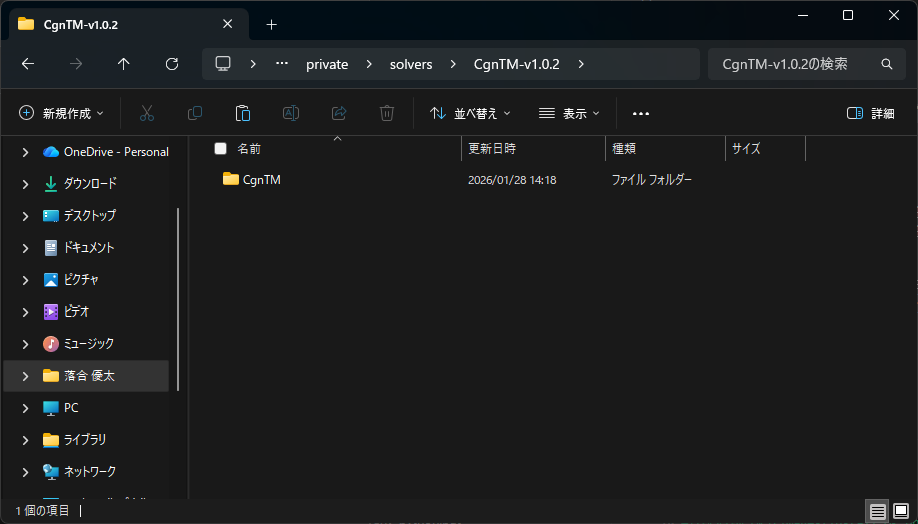

# ダウンロードと配置

このページでは、ソルバーのダウンロードから配置までの手順を説明します。

## 1. ダウンロード
 - Releases ページから最新版を取得します。[リリースページ](https://github.com/Pckk-iRIC/iric-solver-CgnTM/releases)
 - Assets から配布ファイルをダウンロードしてください。

## 2. 配置先
ソルバーは以下の場所に配置します。

`C:\Users\<username>\iRIC_v4\private\solvers\`
※ `<username>` は各ユーザー名に置き換えてください。

## 3. フォルダ構成の確認
配置後、以下のファイルが存在することを確認します。

- `CgnTM/definition.xml`
- `CgnTM/run_solver.bat`
- `CgnTM/main.py`
- `CgnTM/worker.py`

ソルバーフォルダ直下にスクリプト類が配置されていることを確認してください。

## 3-1. 配置例（OK/NG）
**OK例**: ソルバーフォルダ直下に `definition.xml` と各種スクリプトが配置されている。

**NG例**: ソルバーフォルダ直下に必要なファイルが無い、またはサブフォルダに分散している。

## 4. iRIC側の確認
iRICのインストール時に Miniconda3 もインストールする必要があります。  
Miniconda3 の存在確認は `C:\Users\<username>\iRIC_v4\Miniconda3` を参照してください。

## 5. iRICでの認識
iRICを起動し、ソルバー一覧に **CgnTM** が表示されることを確認します。
