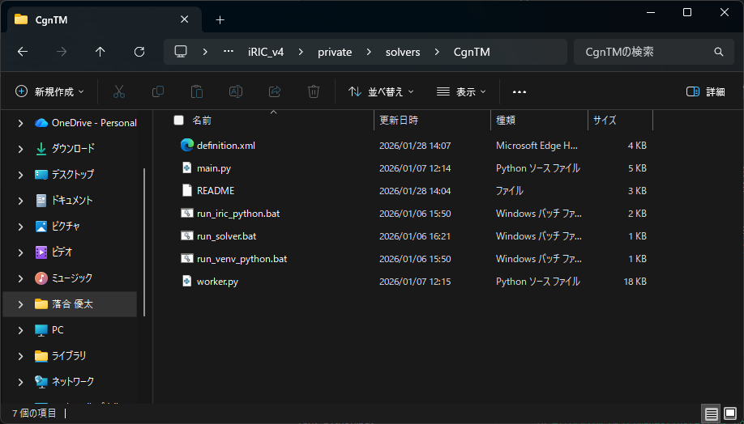
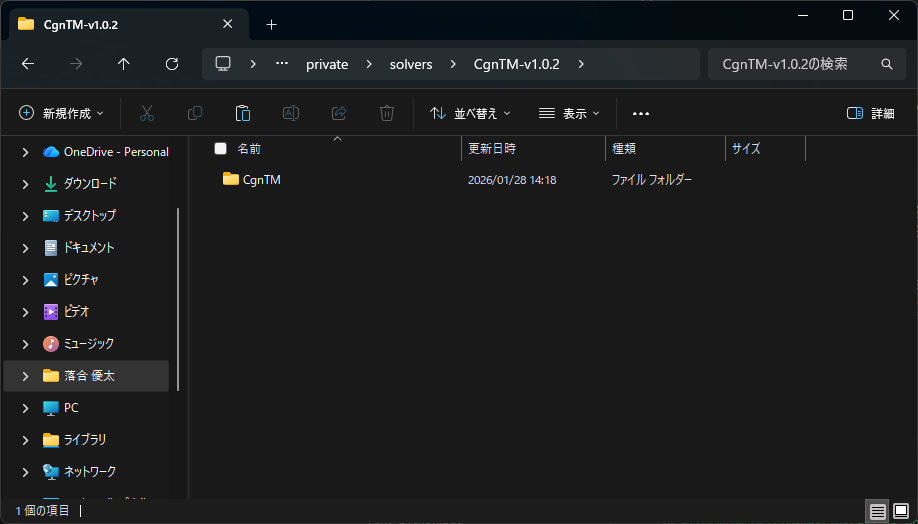

# ダウンロードと配置

このページでは、ソルバーのダウンロードから配置までの手順を説明します。

## 1. ダウンロード
 - Releases ページから最新版を取得します。[リリースページ](https://github.com/Pckk-iRIC/iric-solver-CgnTM/releases)
 - Assets から配布ファイルをダウンロードしてください。

## 2. 配置先
ソルバーは以下の場所に配置します。

`C:\Users\<username>\iRIC_v4\private\solvers\`
※ `<username>` は各ユーザー名に置き換えてください。

## 3. フォルダ構成の確認
配置後、以下のファイルが存在することを確認します。

- `CgnTM/definition.xml`
- `CgnTM/run_solver.bat`
- `CgnTM/main.py`
- `CgnTM/worker.py`

ソルバーフォルダ直下にスクリプト類が配置されていることを確認してください。

## 3-1. 配置例（OK/NG）
**OK例**: ソルバーフォルダ直下に `definition.xml` と各種スクリプトが配置されている。


**NG例**: ソルバーフォルダ直下に必要なファイルが無い、またはサブフォルダに分散している。



## 4. iRIC側の確認
iRICのインストール時に Miniconda3 もインストールする必要があります。  
Miniconda3 の存在確認は `C:\Users\<username>\iRIC_v4\Miniconda3` を参照してください。

## 5. iRICでの認識
iRICを起動し、ソルバー一覧に **CgnTM** が表示されることを確認します。

## 6. 既存インストールの更新
既に `CgnTM` を配置済みの場合は、配布物展開先で `CgnTM` フォルダと同じ階層にある更新スクリプトを実行してください。

- 実体の更新処理は `CgnTM/update_solver.ps1` にあり、`update_CgnTM.bat` は起動ランチャーです。
- 既存の `CgnTM` フォルダは自動でバックアップされます。
- その後、新しいファイルが `private/solvers/CgnTM` にコピーされます。
- 依存関係が変わっていない更新では、通常 `venv` の再作成は不要です。
- 実行後は Enter キー入力までコンソールが閉じないため、結果を確認できます。
- 更新スクリプトは配布物側の `CgnTM` フォルダ内容のみをコピーします（`CgnTM/CgnTM` の二重配置は行いません）。
- 更新本体スクリプト (`update_solver.ps1`) は本番の `private/solvers/CgnTM` にはコピーされません。
- 実行時にバックアップ作成の有無を選択できます（推奨: `Y`）。
- 更新処理は `venv` を除外して同期するため、既存の `venv` は再利用されます。
- バックアップも `venv` を除外して作成されます。

実行例（PowerShell）:
```powershell
.\update_CgnTM.bat
```
