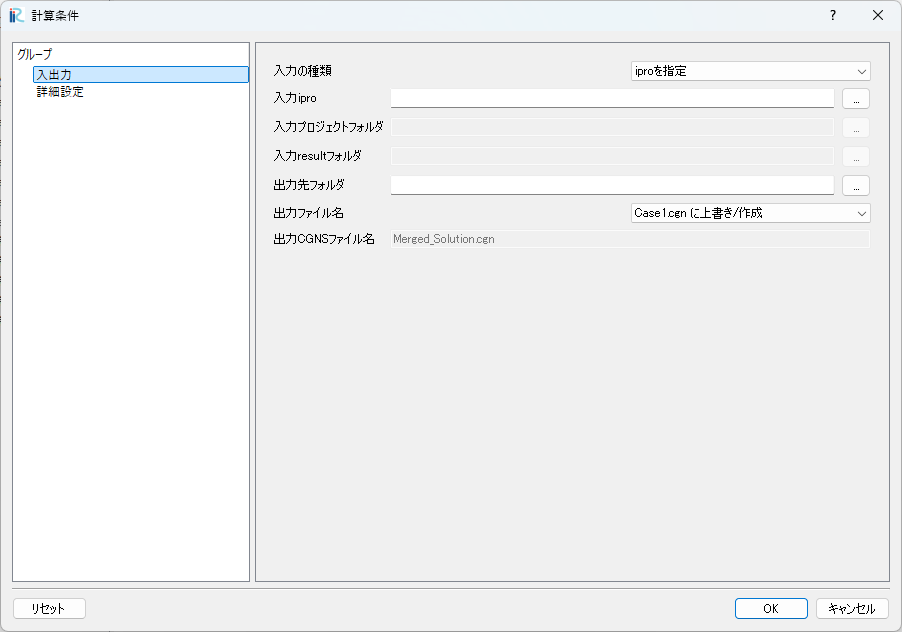
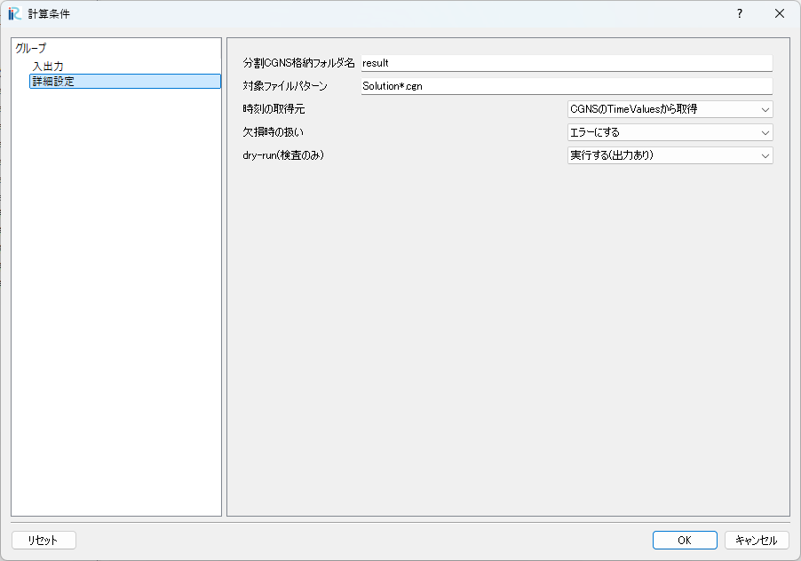

# 使い方

## 入出力タブの項目（GUI表記）

### 計算条件（入出力タブ）

### 入力の種類
GUIの「入力の種類」で入力方法を選択します。

- `iproを指定`
- `プロジェクトフォルダを指定`
- `resultフォルダを指定`

### 入力ipro
`入力の種類` が `iproを指定` の場合に有効です。  
`.ipro` ファイルを指定します。

### 入力プロジェクトフォルダ
`入力の種類` が `プロジェクトフォルダを指定` の場合に有効です。  
展開済みのプロジェクトフォルダ（`project.xml` を含む）を指定します。

### 入力resultフォルダ
`入力の種類` が `resultフォルダを指定` の場合に有効です。  
`Solution*.cgn` が格納されたフォルダを指定します（フォルダ名は `result` でなくても構いません）。

### 出力先フォルダ
出力先のフォルダを指定します。

### 出力ファイル名
出力ファイル名の方式を選びます。

- `Case1.cgn に上書き/作成`
- `別名で出力`

違いは以下の通りです。
- `Case1.cgn に上書き/作成`: 出力先のプロジェクトフォルダ内（または出力先フォルダ直下）に `Case1.cgn` を作成し、既に存在する場合は上書きします。
- `別名で出力`: `出力CGNSファイル名` で指定した名前で出力します。`Case1.cgn` は更新せずに残します。

### 出力CGNSファイル名
`出力ファイル名` が `別名で出力` の場合に有効です。  
出力する CGNS ファイル名を指定します（既定: `Merged_Solution.cgn`）。

## 詳細設定タブの項目（GUI表記）

### 計算条件（詳細設定タブ）

### 分割CGNS格納フォルダ名
`入力の種類` が `iproを指定` または `プロジェクトフォルダを指定` の場合に有効です。  
プロジェクト内の分割CGNSフォルダ名を指定します（既定: `result`）。

### 対象ファイルパターン
分割CGNSを列挙するファイルパターンです（既定: `Solution*.cgn`）。

### 時刻の取得元
時刻の取得方法を選びます。

- `ファイル名から取得`: ファイル名末尾の連続数字を時刻として扱います。
- `CGNSのTimeValuesから取得`: `iRIC/BaseIterativeData/TimeValues[0]` を使います。

### 欠損時の扱い
欠損ステップや不整合がある場合の挙動を選びます。

- `エラーにする`: エラーで停止します。
- `欠損ステップをスキップする`: 欠損をスキップして継続します。

### dry-run(検査のみ)
出力せずに検査のみ行うかを選びます。

- `実行する(出力あり)`
- `検査のみ(出力しない)`

## 処理の流れ（概要）

1. 入力の種類に応じて入力パスを確定します。
2. `対象ファイルパターン` に一致する分割CGNSを列挙し、自然順で並べます。
3. 先頭のCGNSから構造（ポインタ・格子サイズ・BaseIterativeData項目など）を取得します。
4. 各CGNSから時刻と結果を読み込み、時系列として結合します。
5. 出力先に `Case1.cgn` もしくは `出力CGNSファイル名` で統合結果を作成します。
6. `ipro` 入力の場合は出力フォルダを zip 化して `.ipro` を生成します。
7. プロジェクト入力時は、統合後に分割CGNSフォルダを削除します。
